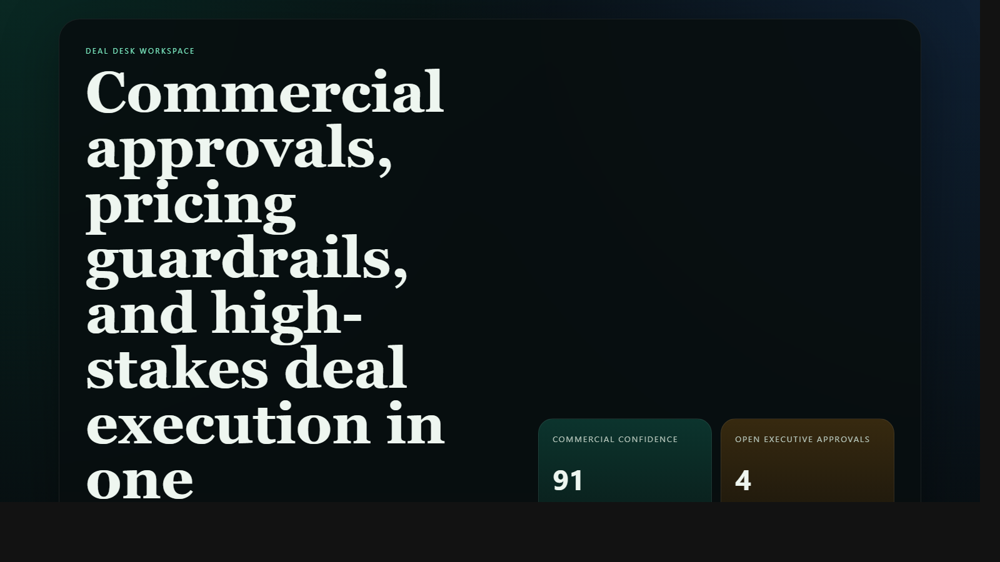
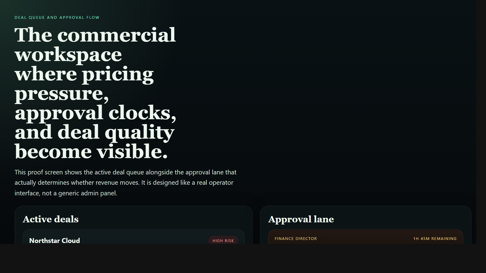
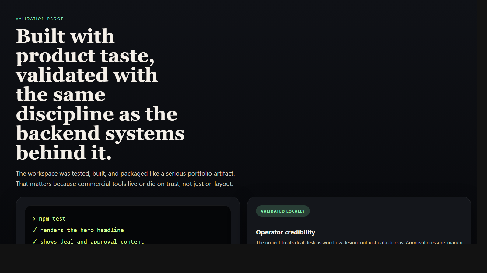

# Deal Desk Workspace

> **React + TypeScript portfolio project** demonstrating commercial approval workflows, pricing guardrails, margin-aware decisioning, and frontend systems design for revenue operations teams.

**Recruiter takeaway:** *"This person can design operator-facing frontend systems with real commercial weight, not just dashboards with nice colors."*

---

## Project Overview

| Attribute | Detail |
|---|---|
| **Frontend Stack** | React 19 + Vite + TypeScript |
| **Domain** | Deal desk, pricing approvals, commercial governance |
| **Audience** | Revenue operations, finance, legal, sales leadership, and channel teams |
| **Signal Areas** | Margin protection · approval pressure · deal risk · velocity |
| **Portfolio Role** | Frontend proof of revenue-systems product design |
| **Validation** | Vitest + Testing Library |

---

## Executive Summary

Deal Desk Workspace is a recruiter-ready frontend project built to feel like a real internal commercial workspace. Instead of pretending deal desk is just quote data in another CRM view, the interface makes approval pressure, pricing guardrails, margin risk, and deal ownership visible in one place.

It is meant to read like a product used by real operators during active commercial motion, not a generic UI exercise.

---

## Business Problem

High-value deals often slow down because pricing, legal, finance, and partner questions live in separate threads, inboxes, and tools. Deal desk teams need more than a record system. They need a workspace that shows what is at risk, who owns the next move, and whether commercial quality is being protected while revenue still moves.

---

## Solution

This workspace turns deal desk into a coordinated interface for:

- active deal visibility
- approval bottleneck tracking
- margin and pricing guardrails
- executive-readable commercial posture
- product-quality UX for operator teams

---

## Architecture

```text
Commercial workflow signals
    |
    v
Static TypeScript data model
    |
    v
React workspace shell
    |
    +--> scorecards
    +--> active deal queue
    +--> approval queue
    +--> margin guardrails
    +--> proof and positioning layer
```

### Workspace Flow

1. Leadership and operators land on one commercial posture view.
2. Active deals expose where pricing, legal, finance, or partner structure introduces pressure.
3. The approval queue clarifies which blocker is slowing signature and who owns it.
4. Margin guardrails show governance without drowning the page in policy text.
5. The proof layer makes the project’s operator and product value obvious to hiring teams.

---

## Screenshots

### Hero Capture



### Deal Queue and Approval Flow



### Validation Proof



---

## Key Design Decisions

| Decision | Rationale |
|---|---|
| **Workspace framing over dashboard framing** | Makes the product feel operational and commercial, not passive |
| **Risk and margin signals first** | Front-loads the decisions that matter most in deal desk workflows |
| **Static demo data** | Keeps the experience easy to run locally while preserving strong portfolio storytelling |
| **Distinct visual direction** | Gives the repo its own commercial-operations identity within the broader portfolio |
| **Operator-first information architecture** | Shows product sense beyond component layout |

---

## What An Engineering Leader Sees Here

- frontend execution grounded in business process reality
- product design that supports pricing, approval, and commercial governance work
- interface decisions that reflect operator pressure, not template defaults
- strong portfolio evidence that frontend and backend systems thinking can live together

---

## Getting Started

### Prerequisites

- Node.js 20+
- npm

### Setup

```bash
git clone https://github.com/mizcausevic-dev/deal-desk-workspace.git
cd deal-desk-workspace
npm install
cp .env.example .env
npm run dev
```

Open:

- `http://localhost:5173`

### Run Tests

```bash
npm test
```

### Build

```bash
npm run build
```

---

## What This Demonstrates

- operator-facing frontend systems design
- revenue and commercial workflow understanding
- pricing and margin governance translated into interface structure
- React + TypeScript execution with tests and production-minded repo hygiene
- portfolio breadth beyond API-only work

---

## Future Enhancements

- quote builder with configurable pricing scenarios
- approval history timeline and stakeholder comments
- contract package and redline coordination
- margin waterfall breakdown
- CRM and billing workflow integration

---

## Tech Stack


### Portfolio Links

- [LinkedIn](https://www.linkedin.com/in/mirzacausevic)
- [Skills Page](https://mizcausevic.com/skills/)
- [Medium](https://medium.com/@mizcausevic)
- [GitHub](https://github.com/mizcausevic-dev)

---

*Part of [mizcausevic-dev's GitHub portfolio](https://github.com/mizcausevic-dev) — demonstrating revenue workflow product thinking, frontend systems design, and operator-ready commercial interfaces.*
